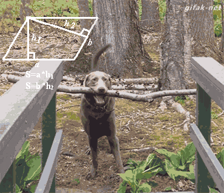

docker
======

---

What is it?
===========

> "An open platform for developers and sysadmins to build, ship, and run distributed applications."

---

---

VM model
--------

---

Docker model
------------

---

Advantages
----------

- Licensing
- Rapid application deployment
- Portability
- Version control
- Lightweight
- ...

---

images vs containers
====================

---

Docker engine
=============

https://docs.docker.com/docker/installation/mac/

---

docker run
----------

    docker run -it ubuntu

---

docker logs
-----------

    docker logs -f bd13

---

docker attach vs docker exec
----------------------------

    docker attach [containerid]
    docker exec -it [containerid] /bin/bash

---

docker history
--------------

    docker history [containerid]

---

docker ps
---------

    docker ps

---

docker pull/push
----------------

    docker pull ubuntu
    docker push myregistry/myimage

---

docker stop/pause/unpause/start/kill
------------------------------------

    # Ex:
    docker stop [containerid]

---

docker rm{,i}
-------------

---

Dockerfiles
===========

    FROM debian:stable
    RUN apt-get update && apt-get install -y --force-yes apache2
    EXPOSE 80 443
    VOLUME ["/var/www", "/var/log/apache2", "/etc/apache2"]
    ENTRYPOINT ["/usr/sbin/apache2ctl", "-D", "FOREGROUND"]

---

Shopa examples!
---------------

---

docker-compose
==============

    db:
      image: postgres
      ports:
        - "5432"
    web:
      build: .
      command: bundle exec rails s -p 3000 -b '0.0.0.0'
      volumes:
        - .:/myapp
      ports:
        - "3000:3000"
      links:
        - db

---

Moarrr shopa examples
---------------------

---

Docker hub
==========

> "Browse, Search, Push, Pull Repositories"

---

docker login/logout
-------------------

Just needed first time

---

docker machine
==============

> "Machine lets you create Docker hosts on your computer, on cloud providers, and inside your own data center."

---

docker swarm
============

> "A Docker-native clustering system"

---

Extras
======

- Kubernetes
- Mesosphere
- ...
