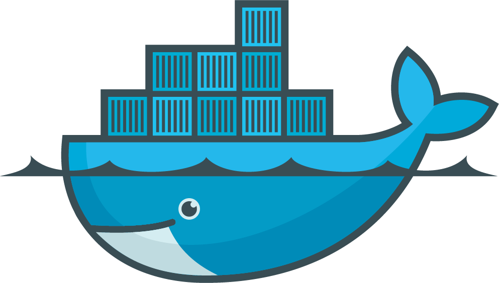
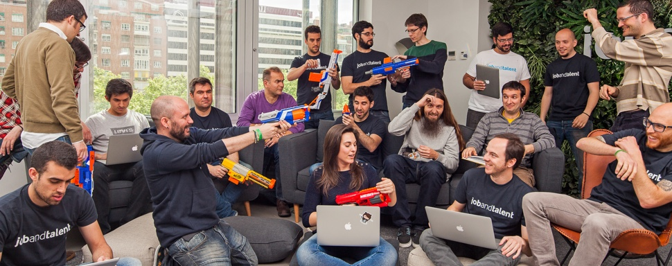

# [fit]Custom Volume
# [fit] **Plugins**
# [@agonzalezro](https://twitter.com/agonzalezro)


---

# [fit] Just one thing

---

# [fit] It's **easy**!


^ I just want you to go out that door with something in your head.

---

## [fit] Easier than you might think

^ Big project made by awesome people.

^ Talk about being scared when Jetstack started talking about the project. But hey! k8s, Flocker, OpenSource... doesn't mind if I can't sleep, or does it? :)

---

# What's a
# [fit] volume?

^ Talk about container problem with volumes.

^ Containers in a pod + containers crashes restart with clean state -> Volume abstraction.

^ Can be ephemeral or not. Different lifetimes. Auto-destruction letter.

---

# Persistent
## **vs**
# Non persistent

^ Volumes lifetime within the pod, if containers inside restart they will have the volume available.

^ PVs: networked storage in the cluster. You can claim it (PVC).

^ You have a cluster of PIs & a bunch of all hard drives || 128M pendrives.

---

# [fit] User POV

---

```
spec:
  containers: 
    - name: web
      image: nginx
      ports: 
        - name: web
          containerPort: 80 
      volumeMounts: 
        - name: www-root
          mountPath: "/usr/share/nginx/html"
          
volumes: 
  - name: www-root
    flocker: 
      datasetName: my-flocker-vol
```

^ We are going to see how to define those keys later.

---

```
...
      volumeMounts: 
        - name: www-root
          mountPath: "/usr/share/nginx/html"
          
volumes: 
  - name: www-root
    flocker: 
      datasetName: my-flocker-vol
```

---

# Available

- AWS EBS, GCE PD, Azure File
- Git Repo
- NFS
- GlusterFS, Cinder
- Flocker
- Secrets

^ EBS: Elastic Block Storage

^ PD: GCE Persitent Disk

^ Gluster -> RedHat

^ Cinder -> OpenStack

^ Flocker: supports various backends itself

^ Secrets: backed by tmpfs (RAM), used to pass sensitive info to pods

---

# Is this 
# [fit] **new**?

---



# [fit] HTTP **API**

---

```
/VolumeDriver.Create
             .Mount 
             .Path
             .Unmount
             .Remove
```

^ Advantages of HTTP API.

---

# [fit] Go **`interface{}`**


---


---

#### 1. Add it to the API (`pkg/api/{,v1/}types.go`):

```go
type VolumeSource struct {
	EmptyDir *EmptyDirVolumeSource `json:"emptyDir,omitempty"`
	Flocker *FlockerVolumeSource `json:"flocker,omitempty"`
    ...
```

^ Explain the the API versioning.

---

#### 2. Add it to the Kubelet (`cmd/kubelet/app/plugins.go`):

```go
func ProbeVolumePlugins(pluginDir string) []volume.VolumePlugin {
	allPlugins := []volume.VolumePlugin{}
	allPlugins = append(allPlugins, empty_dir.ProbeVolumePlugins()...)
    allPlugins = append(allPlugins, git_repo.ProbeVolumePlugins()...)
    ...	
```

^ I am using other examples for this bit. I want to show everything is "standard".

^ Append an instance of the plugin struct.

---

#### 3. Implement the volume plugin (`pkg/volume/...`):

```go
type VolumePlugin interface {
	Init(host VolumeHost) error
	Name() string
	CanSupport(spec *Spec) bool

	NewBuilder(spec *Spec, podRef *api.Pod, opts VolumeOptions)
      (Builder, error)   
	NewCleaner(name string, podUID types.UID)
      (Cleaner, error)
}
```

^ Used for instanciate and manage volumes.

^ We are going through it one by one. No worries if you can't read.

---

```go
type VolumePlugin interface {
	Init(host VolumeHost) error
    Name() string
    CanSupport(spec *Spec) bool
    ...
```

^ Init: called once at beginning. Easy to remember if you think in Go packages.

^ Name: can be namespaced. `kubernetes.io` is reserved.

^ CanSupport: Can support given specification? Used for persistent for example.

---

```go
    ...
	NewBuilder(
      spec *Spec, podRef *api.Pod, opts VolumeOptions,
    ) (Builder, error)
      
    NewCleaner(
      name string, podUID types.UID,
    ) (Cleaner, error)
}
```

^ NewBuilder returns struct used to "attach" the plugin. TODO: is attach proper name?


^ NewCleaner returns struct for clean mess, ex: top secret plugin removing files.

---

#### Simplified example of `NewBuilder`

```go
func (p *plg) NewBuilder(spec, pod, opts) (volume.Builder, error) {
	source, _ := p.getFlockerVolumeSource(spec)
	builder := flockerBuilder{
		flocker: &flocker{
			datasetName: source.DatasetName,
			pod:         pod,
			...
		},
		...
	}
	return &builder, nil
}
```

^ This is a simplified example. It will not even compile.

---

#### 4. Implement the builder

```
type Builder interface {
    Volume
	
    SetUp(fsGroup *int64) error
    SetUpAt(dir string, fsGroup *int64) error
	GetAttributes() Attributes
}
```

^ Volume: it means it will need to implement that interface as well.

^ Methods to setup & mount the volume. You can not create it, talk about Flocker.

^ SetUp & SetUpAt: mounts/unpacks the volume to the mount point, needs to be own by `fsGroup` to be accesible by the Pod. Can be called more than once -> Explain metadata

^ SetUp is usually just calling SetUpAt. Flocker: calling with datasetName

^ GetAttributes: readOnly? managed?

---

#### [fit] Simplified example of `SetUpAt` for git repo

---

# [fit] I **lied**

---


---

```go
func (b *gitRepoVolumeBuilder) SetUpAt(dir string, fsGroup *int64) error {
	if volumeutil.IsReady(b.getMetaDir()) {
		return nil
	}

	wrapped, err := b.plugin.host.NewWrapperBuilder(b.volName, wrappedVolumeSpec, &b.pod, b.opts)
	if err != nil {
		return err
	}
	if err := wrapped.SetUpAt(dir, fsGroup); err != nil {
		return err
	}

	args := []string{"clone", b.source}

	if len(b.target) != 0 {
		args = append(args, b.target)
	}
	if output, err := b.execCommand("git", args, dir); err != nil {
		return fmt.Errorf("failed to exec 'git %s': %s: %v",
			strings.Join(args, " "), output, err)
	}

	files, err := ioutil.ReadDir(dir)
	if err != nil {
		return err
	}

	if len(b.revision) == 0 {
		// Done!
		volumeutil.SetReady(b.getMetaDir())
		return nil
	}

	var subdir string

	switch {
	case b.target == ".":
		// if target dir is '.', use the current dir
		subdir = path.Join(dir)
	case len(files) == 1:
		// if target is not '.', use the generated folder
		subdir = path.Join(dir, files[0].Name())
	default:
		// if target is not '.', but generated many files, it's wrong
		return fmt.Errorf("unexpected directory contents: %v", files)
	}

	if output, err := b.execCommand("git", []string{"checkout", b.revision}, subdir); err != nil {
		return fmt.Errorf("failed to exec 'git checkout %s': %s: %v", b.revision, output, err)
	}
	if output, err := b.execCommand("git", []string{"reset", "--hard"}, subdir); err != nil {
		return fmt.Errorf("failed to exec 'git reset --hard': %s: %v", output, err)
	}

	volumeutil.SetReady(b.getMetaDir())
	return nil
}
```

^ Please, don't try to read this.

^ There is no simplified version, but I can tell you what it does.

---

1. Check meta: was it called before? Is it ready?
2. Use empty dir to prepare the path
3. `git clone` it
4. Checkout the `revision` sent on the pod definition
5. Job done? Mark as ready

---

#### Important bit of `empty_dir`

```go
	switch ed.medium {
	case api.StorageMediumDefault:
		err = ed.setupDir(dir)
	case api.StorageMediumMemory:
		err = ed.setupTmpfs(dir, securityContext)
	default:
		err = fmt.Errorf("unknown storage medium %q", ed.medium)
	}

	volume.SetVolumeOwnership(ed, fsGroup)
```

---

#### [fit] Another simplified example for Flocker

---

# [fit] I lied
# [fit] **again**

---


---

```go
func (b flockerBuilder) SetUpAt(dir string, fsGroup *int64) error {
	if volumeutil.IsReady(b.getMetaDir()) {
		return nil
	}

	if b.client == nil {
		c, err := b.newFlockerClient()
		if err != nil {
			return err
		}
		b.client = c
	}

	datasetID, err := b.client.GetDatasetID(dir)
	if err != nil {
		return err
	}

	s, err := b.client.GetDatasetState(datasetID)
	if err != nil {
		return fmt.Errorf("The volume '%s' is not available in Flocker. You need to create this manually with Flocker CLI before using it.", dir)
	}

	primaryUUID, err := b.client.GetPrimaryUUID()
	if err != nil {
		return err
	}

	if s.Primary != primaryUUID {
		if err := b.updateDatasetPrimary(datasetID, primaryUUID); err != nil {
			return err
		}
	}

	b.flocker.path = s.Path
	volumeutil.SetReady(b.getMetaDir())
	return nil
}
```

^ Pretty simple in comparison, but Flocker client doing hard job

---

1. Was it called? Is it ready?
2. Is the dataset ready? If not, not my problem mate
3. If primary UUIDs doesn't match (rescheduled pod), update them
4. Wait until ready
5. Mark as ready

--- 

#### 5. Implement the Persistent Volume Plugin

```go
type PersistentVolumePlugin interface {
	VolumePlugin
	
    GetAccessModes() []api.PersistentVolumeAccessMode
}
```

---

```go
func (p *plg) GetAccessModes() []api.PersistentVolumeAccessMode {
	return []api.PersistentVolumeAccessMode{
		api.ReadWriteOnce,
	}
}
```

^ This example is AWS.

---

# [fit][http://bit.ly/kubecon](bit.ly/kubecon)

# [fit]

 


^ Thanks to Jetstack and Flocker for givin me the chance.

---

# [fit] "Problems"


^ Follow trend: boat sinking, Kelsey and Kubernetes (but we are in a k8s conf) & Kelsey already spoke.

^ Rena broke in two after enduring heavy winds and seas overnight. 2 days later it sunken.

^ Tough deadline: some of them are real problems, some they aren't.

---

- CLAs
- Shippable & Jenkins
- `hack/` scripts
- PR

^ CLAs (Copyright License Agreement) difficult to sign. Matt's example. Perhaps different now after the CNCF (Cloud Native Compute Foundation).

^ Shippable & Jenkins were flaky: false positives (or false negatives?). Months ago.

^ `hack/` for update docs & check APIs, sometimes they failed.

^ PR: loads of comments. This is good, but be ready!

---

# Summary

1. Add **API**
2. Enable the plugin on the **Kubelet**
3. Implement **VolumePlugin** interface: `NewBuilder` & `NewCleaner`
4. Implement the **builder** itself: `SetUpAt`
5. Persistent?
6. ❤️

^ Mention tests! Really, no, Reallyyyyy!

---


---

# [fit] Just one (more) thing

---


^ This is my office.

^ Sadly Travolta doesn't work with us, but we have a bunch of really good people trying to find the best job that fits a person.

^ Nice algorithm team for that and a lot of good people.

---

# [fit] We are **hiring** at




^ You were really expecting this one.

^ Go, RoR, Scala, containers, scheduling, etc...

^ Help us with scheduling!

---


# [fit] Thanks!
# [fit] [@agonzalezro](https://twitter.com/agonzalezro)
