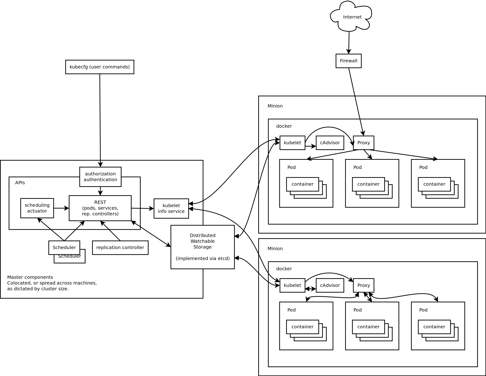

# [fit] Python, **Kubernetes**
# & friends
## [@agonzalezro](https://twitter.com/agonzalezro)

---

# [fit] What is **Kubernetes**?

^ Runs containers everywhere.

^ Not a PAAS.

^ Optimize hw, scale, deploy...

---

> **Framework** for building distributed systems.

(Kelsey's dixit)

---

^ k8s is NOT Paris Hilton

---

# Our first app!

    $ kubectl run pygrunn \
      --image=python:2.7 \
      --command -- python -m SimpleHTTPServer

^ I am using Google Cloud

---

# [fit] What do we get here?

---

# A pod

    $ kubectl get pods
    NAME                       READY     STATUS    RESTARTS   AGE
    pygrunn-1906403705-dckh7   1/1       Running   0          1m

---

# A Replica set

    $ kubectl get replicasets
    NAME                 DESIRED   CURRENT   AGE
    pygrunn-1552838933   1         1         11s
---

# And a deployment

    $ kubectl get deployments
    NAME      DESIRED   CURRENT   UP-TO-DATE   AVAILABLE   AGE
    pygrunn   1         1         1            1           2m

---

# Show it to the world

    $ kubectl expose deployment pygrunn \
      --port=80 --target-port=8000 --type=LoadBalancer

^ No index.html, create it in mean time

^ It needs to be exposed

---

# Let's use the waiting time

    $ kubectl exec -it pygrunn-1906403705-dckh7 bash

---

# Here it is

    $ kubectl get services
    NAME         CLUSTER-IP     EXTERNAL-IP     PORT(S)   AGE
    pygrunn      10.3.255.124   130.211.52.23   80/TCP    57s

---

# HN front page!

    $ kubectl scale deployment pygrunn --replicas=3
    
^ All the sudden, PyGrunn post goes to HN.
    
---

# [fit] THE END
# (for now)

---

^ Still have some time

---

# What we did there?

- [Pods](http://kubernetes.io/docs/user-guide/pods/)
- [Replica Set](http://kubernetes.io/docs/user-guide/replicasets/)
- [Service](http://kubernetes.io/docs/user-guide/services/)
- [**Deployment**](http://kubernetes.io/docs/user-guide/deployments/)

^ Recapitulate

---

# [fit] A "real" deployment

---

# main.py

    from flask import Flask, url_for
    app = Flask(__name__)

    @app.route('/')
    def index():
        return ''.format(
            url_for('static', filename='grumpy.gif')
        )

    if __name__ == '__main__':
        app.run(host='0.0.0.0')

^ App that shows an image

---

# Dockerfile

    FROM python:2.7.11-onbuild

    EXPOSE 5000
    CMD ["uwsgi", "-http 5000", "-w main"]

^ I am using py2 because Armin wouldn't like py3 :D

^ Image vs container

---

    $ docker build -t agonzalezro/pygrunn:grumpy .
    $ docker push agonzalezro/pygrunn

---

# deployment.yaml (1/3)

    apiVersion: extensions/v1beta1 
    kind: Deployment
    metadata:
      name: pygrunn-deploy
      labels:
        name: pygrunn-deploy
    ...
        
^ Beta
^ Labels

---

# deployment.yaml (2/3)
    ...
    spec:
      replicas: 3
      selector:
        matchLabels:
          name: flask-app
      template:
        metadata:
          labels:
            name: flask-app
    ...

---

# deployment.yaml (3/3)

    ...
        spec:
          containers:
          - name: app
            image: agonzalezro/pygrunn:grumpy
            ports:
              - containerPort: 5000
          - name: nginx
            image: agonzalezro/pygrunn-nginx
            ports:
              - containerPort: 80
            readinessProbe:
              httpGet:
                path: /
                port: 80

^ Nginx as proxy
^ readiness & liveness probe

---

![right] (gifs/mindblown.gif)

    apiVersion: extensions/v1beta1 
    kind: Deployment
    metadata:
      name: pygrunn-deploy
      labels:
        name: pygrunn-deploy
    spec:
      replicas: 3
      selector:
        matchLabels:
          name: flask-app
      template:
        metadata:
          labels:
            name: flask-app
        spec:
          containers:
          - name: app
            image: agonzalezro/pygrunn:happy
            ports:
              - containerPort: 5000
          - name: nginx
            image: agonzalezro/pygrunn-nginx
            ports:
              - containerPort: 80
            readinessProbe:
              httpGet:
                path: /
                port: 80

---

# service.yaml

    apiVersion: v1
    kind: Service
    metadata:
      name: flask-service
    spec:
      type: LoadBalancer
      ports:
        - port: 80
          targetPort: 5000
      selector:
        name: flask-app

^ Remember what I said about labels?

---

    $ kubectl create -f deployment.yaml -f service.yaml

---

    $ sed -i "s/replicas: 3/replicas: 5/" deployment.yaml
    $ kubectl apply -f deployment.yaml

---

    $ sed -i "s/grumpy/happy/" deployment.yaml
    $ kubectl apply -f deployment.yaml

---

# Homework

- ~~Add a nginx in top~~
- Add a DB
- Use a private registry

---

# [fit] THE END
# (again)

---

---

^ Asking yourself what's missing.

---

^ I am going to tell you something that I am pretty sure you didn't heard in any other place.

---

# [fit] **Thanks!**
# [fit] [@agonzalezro](https://twitter.com/agonzalezro)
