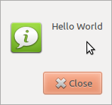
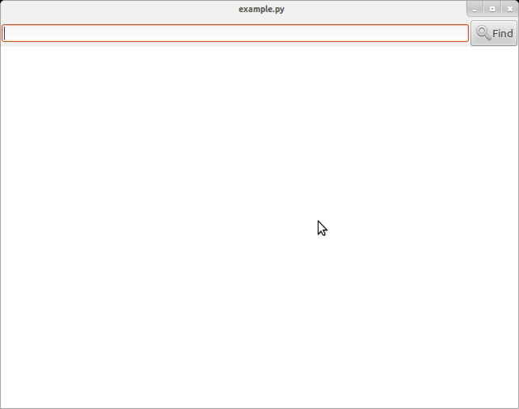
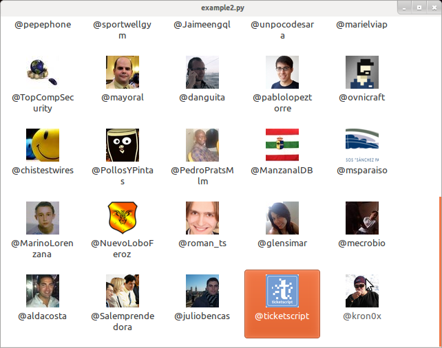

Introduction to **GTK3** development
====================================

---

What's it?
==========

2 layers
--------

- C & your favourite language.

Why C?
------

- Good for fast-path applications like: Graphics, Multimedia...

Why other layer?
----------------

- Write complex software on C is harder.
- No Garbage Collector on C

---

Example #1
==========

---

Hello world
===========

.notes: Gtk.ResponseType.CANCEL

This is a Gtk.Message Dialog example:

Extremely original text inside!

---

Share the code!
===============

Python code
-----------

    !python
    from gi.repository import Gtk
    Gtk.MessageDialog(None,
                      0,
                      Gtk.MessageType.INFO,
                      Gtk.ButtonsType.CLOSE,
                      "Hello World").run()

C declaration
-------------

    !c
    GtkWidget* gtk_message_dialog_new (GtkWindow *parent,
                                       GtkDialogFlags flags,
                                       GtkMessageType type,
                                       GtkButtonsType buttons,
                                       const gchar *message_format, ...);

C call
------

    !c
    GtkMessageDialog* msg = gtk_message_dialog_new (NULL,
                                                    0,
                                                    GTK_MESSAGE_INFO,
                                                    GTK_BUTTONS_CLOSE,
                                                    "Hello World");
      msg.run()

---

Differences
===========

Python is OO, but C no. Did you know that? :)

    !python
    b = Gtk.Button(...)
    b.set_label("foo")

It changes, but continue being similar:

    !c
    GtkWidget* b = gtk_button_new(...);
    gtk_button_set_label(b, "foo");

---

Events
======

---

Binding events
==============

The window development on GTK as many others is event-drive, take a look:

    !python
    from gi.repository import Gtk

    # Widgets
    window = Gtk.Window()
    vbox = Gtk.VBox()
    entry = Gtk.Entry()
    button = Gtk.Button('print it!')
    vbox.add(entry)
    vbox.add(button)
    window.add(vbox)

    # Event functions
    def on_button_clicked(widget):
        print entry.get_text()

    # Signals
    window.connect('delete-event', Gtk.main_quit)
    button.connect('clicked', on_button_clicked)

    # Show them
    window.show_all()
    Gtk.main()

---

Example #2
==========

---

Something little more complex
=============================

This is the code to create the window, what do you think that will be created?

    !python
    self.window = Gtk.Window()
    # Toolbar
    hbox = Gtk.HBox()
    self.entry = Gtk.Entry()
    self.button = Gtk.Button(stock=Gtk.STOCK_FIND)
    hbox.pack_start(self.entry, True, True, 0)
    hbox.pack_start(self.button, False, True, 0)
    # Web view
    self.view = WebKit.WebView()
    scrolled = Gtk.ScrolledWindow()
    scrolled.add(self.view)
    scrolled.show()
    # Progress
    self.progress = Gtk.ProgressBar()
    # All the rest
    vbox = Gtk.VBox()
    vbox.pack_start(hbox, False, True, 0)
    vbox.pack_start(scrolled, True, True, 0)
    vbox.pack_start(self.progress, False, True, 0)
    self.window.add(vbox)

---

Here is it!
===========

---

Ok, let's bind signals
======================

    !python
    def bind_signals(self):
        self.window.connect('delete-event', Gtk.main_quit)
        self.button.connect('clicked', self.on_button_clicked)
        self.view.connect('load-progress-changed', self.on_load_progress)

    def get_full_url(self, text):
        return text if text.startswith('http') else 'http://%s' % text

    def on_button_clicked(self, widget):
        self.view.open(
                self.get_full_url(self.entry.get_text()))

    def on_load_progress(self, widget, amount):
        self.progress.set_fraction(amount / 100.0)
        if amount == 100 or amount == 0:
            self.progress.hide()
        else:
            self.progress.show()

---

Final results
=============

---

Example #3
==========

---

Twitter
=======

Now, we will create a Icon List, what do we need?

- Window container.
- Model.
- The list.
- The icons.

Extra stuff:

- A function to retrieve twitter followers.

---

The twitter part
================

This is easy, isn't? Only take a look over it:

    !python
    URL_IDS = ('https://api.twitter.com/1/followers/ids.json?'
               'cursor=-1&screen_name=agonzalezro')
    URL_LOOKUP = ('https://api.twitter.com/1/users/lookup.json?'
                  'user_id=%s&include_entities=true')

    def get_twitter_users(limit):
        response = urllib.urlopen(URL_IDS)
        ids = json.loads(response.read()).get('ids')
        ids = ','.join(map(str, ids[0:limit]))  # Max 100 per query
        response = urllib.urlopen(URL_LOOKUP % ids)
        users = json.loads(response.read())
        minimal_info = []
        for user in users:
            minimal_info.append((user['profile_image_url'],
                                 '@%s' % user['screen_name']))
        return minimal_info

Now, Jack the Ripper way...

---

Model
=====

Create:

    !python
    store = Gtk.ListStore(GdkPixbuf.Pixbuf, str)

Fill:

    !python
    store.append([get_icon_from_url('http...agonzalezro.jpg'),
                  '@agonzalezro'])

Auxiliar:

    !python
    def get_icon_from_url(url):
        icon = GdkPixbuf.PixbufLoader()
        icon.set_size(48, 48)
        icon.write(urllib.urlopen(url).read())
        icon.close()
        return icon.get_pixbuf()

---

Signals
=======

On the signal we get the path:

    !python
    icons_list.connect('item-activated', on_item_activated)

    def on_item_activated(self, widget, item):
        webbrowser.open('http://twitter.com/%s' % self.store[item][1][1:])

Then we have that ``store[item][1]`` will be the name and ``store[item][0]`` is
the Pixbuf.

---

Show me the code!
=================

---

Screenshot
----------

---

Thanks!
=======

.qr: 350|https://github.com/agonzalezro/slides/tree/master/PyGI

